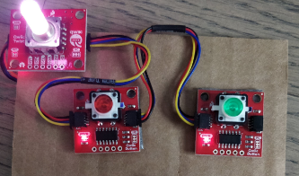

# Ph-UI!!!

For lab this week, we focus on both on sensing, to bring in new modes of input into your devices, as well as prototyping the physical look and feel of the device. You will think about the physical form the device needs to perform the sensing as well as present the display or feedback about what was sensed. 

## Part 1 Lab Preparation

### Get the latest content:
As always, pull updates from the class Interactive-Lab-Hub to both your Pi and your own GitHub repo. As we discussed in the class, there are 2 ways you can do so:

**\[recommended\]**Option 1: On the Pi, `cd` to your `Interactive-Lab-Hub`, pull the updates from upstream (class lab-hub) and push the updates back to your own GitHub repo. You will need the personal access token for this.

```
pi@ixe00:~$ cd Interactive-Lab-Hub
pi@ixe00:~/Interactive-Lab-Hub $ git pull upstream Fall2021
pi@ixe00:~/Interactive-Lab-Hub $ git add .
pi@ixe00:~/Interactive-Lab-Hub $ git commit -m "get lab4 content"
pi@ixe00:~/Interactive-Lab-Hub $ git push
```

Option 2: On your your own GitHub repo, [create pull request](https://github.com/FAR-Lab/Developing-and-Designing-Interactive-Devices/blob/2021Fall/readings/Submitting%20Labs.md) to get updates from the class Interactive-Lab-Hub. After you have latest updates online, go on your Pi, `cd` to your `Interactive-Lab-Hub` and use `git pull` to get updates from your own GitHub repo.

### Start brasinstorming ideas by reading: 
* [What do prototypes prototype?](https://www.semanticscholar.org/paper/What-do-Prototypes-Prototype-Houde-Hill/30bc6125fab9d9b2d5854223aeea7900a218f149)
* [Paper prototyping](https://www.uxpin.com/studio/blog/paper-prototyping-the-practical-beginners-guide/) is used by UX designers to quickly develop interface ideas and run them by people before any programming occurs. 
* [Cardboard prototypes](https://www.youtube.com/watch?v=k_9Q-KDSb9o) help interactive product designers to work through additional issues, like how big something should be, how it could be carried, where it would sit. 
* [Tips to Cut, Fold, Mold and Papier-Mache Cardboard](https://makezine.com/2016/04/21/working-with-cardboard-tips-cut-fold-mold-papier-mache/) from Make Magazine.
* [Surprisingly complicated forms](https://www.pinterest.com/pin/50032245843343100/) can be built with paper, cardstock or cardboard.  The most advanced and challenging prototypes to prototype with paper are [cardboard mechanisms](https://www.pinterest.com/helgangchin/paper-mechanisms/) which move and change. 
* [Dyson Vacuum Cardboard Prototypes](http://media.dyson.com/downloads/JDF/JDF_Prim_poster05.pdf)
<p align="center"> </p>

### Gathering materials for this lab:

* Cardboard (start collecting those shipping boxes!)
* Found objects and materials--like bananas and twigs.
* Cutting board
* Cutting tools
* Markers

(We do offer shared cutting board, cutting tools, and markers on the class cart during the lab, so do not worry if you don't have them!)

## Deliverables \& Submission for Lab 4

The deliverables for this lab are, writings, sketches, photos, and videos that show what your prototype:
* "Looks like": shows how the device should look, feel, sit, weigh, etc.
* "Works like": shows what the device can do.
* "Acts like": shows how a person would interact with the device.

For submission, the readme.md page for this lab should be edited to include the work you have done:
* Upload any materials that explain what you did, into your lab 4 repository, and link them in your lab 4 readme.md.
* Link your Lab 4 readme.md in your main Interactive-Lab-Hub readme.md. 
* Group members can turn in one repository, but make sure your Hub readme.md links to the shared repository.
* Labs are due on Mondays, make sure to submit your Lab 4 readme.md to Canvas.


## Lab Overview

A) [Capacitive Sensing](#part-a)

B) [OLED screen](#part-b) 

C) [Paper Display](#part-c)

D) [Materiality](#part-d)

E) [Servo Control](#part-e)

F) [Record the interaction](#part-f)

## The Report (Part 1: A-D, Part 2: E-F)

### Part A
### Capacitive Sensing, a.k.a. Human-Twizzler Interaction 

We want to introduce you to the [capacitive sensor](https://learn.adafruit.com/adafruit-mpr121-gator) in your kit. It's one of the most flexible input devices we are able to provide. At boot, it measures the capacitance on each of the 12 contacts. Whenever that capacitance changes, it considers it a user touch. You can attach any conductive material. In your kit, you have copper tape that will work well, but don't limit yourself! In the example below, we use Twizzlers--you should pick your own objects.


<p float="left">


</p>

Plug in the capacitive sensor board with the QWIIC connector. Connect your Twizzlers with either the copper tape or the alligator clips (the clips work better). In this lab, we will continue to use the `circuitpython` virtual environment we created before. Activate `circuitpython` and `cd` to your Lab 4 folder to install the requirements by:

```
(circuitpython) pi@ixe00:~/Interactive-Lab-Hub/Lab 4 $ pip3 install -r requirements.txt
```


These Twizzlers are connected to pads 6 and 10. When you run the code and touch a Twizzler, the terminal will print out the following

```
(circuitpython) pi@ixe00:~/Interactive-Lab-Hub/Lab 4 $ python cap_test.py 
Twizzler 10 touched!
Twizzler 6 touched!
```

#### Testing - Adafruit MPR121 12-Key Capacitive Touch Sensor


### Part B
### More sensors

#### Light/Proximity/Gesture sensor (APDS-9960)

We here want you to get to know this awesome sensor [Adafruit APDS-9960](https://www.adafruit.com/product/3595). It is capable of sensing proximity, light (also RGB), and gesture! 


Connect it to your pi with Qwiic connector and try running the three example scripts individually to see what the sensor is capable of doing!

```
(circuitpython) pi@ixe00:~/Interactive-Lab-Hub/Lab 4 $ python proximity_test.py
...
(circuitpython) pi@ixe00:~/Interactive-Lab-Hub/Lab 4 $ python gesture_test.py
...
(circuitpython) pi@ixe00:~/Interactive-Lab-Hub/Lab 4 $ python color_test.py
...
```

You can go the the [Adafruit GitHub Page](https://github.com/adafruit/Adafruit_CircuitPython_APDS9960) to see more examples for this sensor!

#### Testing - Light_Proximity_Gesture sensor (APDS-9960)


#### Rotary Encoder

A rotary encoder is an electro-mechanical device that converts the angular position to analog or digital output signals. The [Adafruit rotary encoder](https://www.adafruit.com/product/4991#technical-details) we ordered for you came with separated breakout board and encoder itself, that is, they will need to be soldered if you have not yet done so! We will be bringing the soldering station to the lab class for you to use, also, you can go to the MakerLAB to do the soldering off-class. Here is some [guidance on soldering](https://learn.adafruit.com/adafruit-guide-excellent-soldering/preparation) from Adafruit. When you first solder, get someone who has done it before (ideally in the MakerLAB environment). It is a good idea to review this material beforehand so you know what to look at.

<p float="left">


</p>

Connect it to your pi with Qwiic connector and try running the example script, it comes with an additional button which might be useful for your design!

```
(circuitpython) pi@ixe00:~/Interactive-Lab-Hub/Lab 4 $ python encoder_test.py
```

You can go to the [Adafruit Learn Page](https://learn.adafruit.com/adafruit-i2c-qt-rotary-encoder/python-circuitpython) to learn more about the sensor! The sensor actually comes with an LED (neo pixel): Can you try lighting it up? 

#### Testing - Adafruit I2C QT Rotary Encoder


#### Joystick

A [joystick](https://www.sparkfun.com/products/15168) can be used to sense and report the input of the stick for it pivoting angle or direction. It also comes with a button input!

<p float="left">

</p>

Connect it to your pi with Qwiic connector and try running the example script to see what it can do!

```
(circuitpython) pi@ixe00:~/Interactive-Lab-Hub/Lab 4 $ python joystick_test.py
```

You can go to the [SparkFun GitHub Page](https://github.com/sparkfun/Qwiic_Joystick_Py) to learn more about the sensor!

#### (Optional) Distance Sensor

Note: We did not distribute this sensor to you, so if you are interested in playing with it, please come pick it up from the TA!

Earlier we have asked you to play with the proximity sensor, which is able to sense object within a short distance. Here, we offer [Qwiic Multi Distance Sensor](https://www.sparkfun.com/products/17072), which has a field of view of about 25° and is able to detect objects up to 3 meters away! 

<p float="left">

</p>

Connect it to your pi with Qwiic connector and try running the example script to see how it works!

```
(circuitpython) pi@ixe00:~/Interactive-Lab-Hub/Lab 4 $ python distance_test.py
```

You can go to the [SparkFun GitHub Page](https://github.com/sparkfun/Qwiic_VL53L1X_Py) to learn more about the sensor and see other examples!

#### Testing - Qwiic Multi Distance Sensor (VL53L3CX)


### Part C

### Lab Partners
For this Lab, we are a team of 3 people.
- Xingyu Tao (xt75)
- Wenlan Wei (ww367) 
- Jiacheng Peng (jp948)
### Physical considerations for sensing

Usually, sensors need to positioned in specific locations or orientations to make them useful for their application. Now that you've tried a bunch of the sensors, pick one that you would like to use, and an application where you use the output of that sensor for an interaction. For example, you can use a distance sensor to measure someone's height if you position it overhead and get them to stand under it.

**\*\*\*Draw 5 sketches of different ways you might use your sensor, and how the larger device needs to be shaped in order to make the sensor useful.\*\*\***

### Idea Generation
We chose to take a more creative approach with our idea generation. Instead of first choosing sensors, we decided to first brainstorm **tasks and functions** of our product.

We came up with 5 very different product ideas, and then thought about how we would use the sensors available to us to accomplish these ideas.

Because we are a group of 3, we decided to incorporate multiple sensors into each of our ideas in order to provide multiple ways of interacting with each device.

### Idea 1 - Smart Timer

#### Product Description

The **Smart Timer** is a product that allows you to set a countdown timer using several interactive methods. 
- First, you can *wake up* the device via waving over the device *or* through touching the physical touch sensor interface. 
- Then, you would be able to set the timer and activate it through a physical dial and touch sensor interface. The screen will be showing the time as it counts down.
- As the countdown reaches zero on the screen, the Smart Timer will announce it by both emitting a sound, and using a LED light. 
- The User can then dismiss the timer by waving over the device *or* through touching the physical touch sensor interface.

#### Sensors/Components Used

`distance sensor`, `capacitive touch sensor`, `rotating dial`, `microphone`, `LED light`, `screen`


#### Sample Product Design


### Idea 2 - Smart Blind

#### Sensors/Components Description

The **Smart Blind** is a device that takes vocie input and open/close the blind according to the voice input.
- The user activates the blind by simply saying the command *"open"* or *"close"*
- The screen will display the current state of the blind (closed, open, or in-between)
- The servo motor will drive the string that pulls the blind open/close in a smooth manner
- The user can stop the opening or closing at any time by saying the command *"stop"*
- Otherwise the blind will stop only when fully opened or closed

#### Sensors/Components Used

`speaker`, `servo mottor`, `screen`


#### Sample Product Design


### Idea 3 - Safe Keeper

#### Product Description

The **Safe Keeper** detects unauthorized access and activates the alarm by using the luminosity sensor, and can be activated by an LED button.
- The user can activate the safe alarm by pressing the LED button
- The screen will turn on and display a yellow color to indicate that it is armed
- The user can proceed to lock the safe
- If the safe is forced open without the combination, the Safe Keeper's luminosity sensor will sense the light and go into Alarm mode
- The screen will flash in orange, and the microphone will play a lound alarm noise to alert nearby people

#### Sensors/Components Used

`luminosity sensor`, `LED button`, `screen`, `microphone`


#### Sample Product Design


### Idea 4 - Racing Simulator

#### Product Description

**Racing simulator** is a simulation game device that contains a steering wheel and two paddles that simulates driving a race car. 
- The LED button will be used to turn the gaming device on and off
- A Joystick will be used for steering the car left and right
- Capacitance detectors will be attached to the paddles to simulate acceleration and braking
- The screen will be displaying a small simulated road, which will curve left or right depending on the steering
- The screen will also be displaying a speedometer, and the road will move faster/slower depending on the simulated speed.

#### Sensors/Components Used

`capacitive touch sensor`, `LED button`, `joystick`, `screen`

#### Sample Product Design


### Idea 5 - Night Path

#### Product Description

The **Night Path** is an assistance device that helps the user navigate dark hallways at night without the need of stumbling to find a light switch
- The device can be turned on by pressing it with your feet, and the screen will flash an orange color to confirm
- When the user wakes up during the night and has to navigate the hallway, the distance sensor will detect the user approaching, and light up a warm orange light for a duration of 10 seconds
- This way the user can see the path clearly as they go through the hallway in relative darkness

#### Sensors/Components Used

`distance sensor`, `screen`, `LED light`, `capacitive touch sensor`

#### Sample Product Design


**\*\*\*What are some things these sketches raise as questions? What do you need to physically prototype to understand how to anwer those questions?\*\*\***

### Design Questions

While we had a lot of discussions about the *stylistic* design of our products, one immediate implementation question we had was - *can we actually wire the sensors and the Raspberry Pi to fit our design?*

In fact, we attempted to make an example cardboard interface for our first idea, the **Smart Timer**, and ran into placement problems when trying place the Raspberry Pi with the Rotary Dial, with the two components knocking into each other. We had to flip the Raspberry Pi in order to make it work. This is despite having designed space for it in our sketches. We didn't find out about the placement problem until we tried to physically place the components together.


**\*\*\*Pick one of these designs to prototype.\*\*\***

### Idea Selection

We picked **Idea 1 - Smart Timer** to design for several reasons:

- It involved a variety of sensors, so we think it will be a challenging but fun project to design and build
  - `distance sensor`, `capacitive touch sensor`, `rotating dial`, `microphone`, `LED light`, `screen`
- We think that it would be interesting to try to design a product that can be activated through multiple ways, by waving or by pressing a touch sensor
- We wanted to combine some of the learnings we have accumulated since Lab 1 and Lab 2 to build a fun interactive device


### Part D
### Physical considerations for displaying information and housing parts


Here is an Pi with a paper faceplate on it to turn it into a display interface:


This is fine, but the mounting of the display constrains the display location and orientation a lot. Also, it really only works for applications where people can come and stand over the Pi, or where you can mount the Pi to the wall.

Here is another prototype for a paper display:


Your kit includes these [SparkFun Qwiic OLED screens](https://www.sparkfun.com/products/17153). These use less power than the MiniTFTs you have mounted on the GPIO pins of the Pi, but, more importantly, they can be more flexibily be mounted elsewhere on your physical interface. The way you program this display is almost identical to the way you program a  Pi display. Take a look at `oled_test.py` and some more of the [Adafruit examples](https://github.com/adafruit/Adafruit_CircuitPython_SSD1306/tree/master/examples).

<p float="left">


</p>


It holds a Pi and usb power supply, and provides a front stage on which to put writing, graphics, LEDs, buttons or displays.

This design can be made by scoring a long strip of corrugated cardboard of width X, with the following measurements:

| Y height of box <br> <sub><sup>- thickness of cardboard</sup></sub> | Z  depth of box <br><sub><sup>- thickness of cardboard</sup></sub> | Y height of box  | Z  depth of box | H height of faceplate <br><sub><sup>* * * * * (don't make this too short) * * * * *</sup></sub>|
| --- | --- | --- | --- | --- | 

Fold the first flap of the strip so that it sits flush against the back of the face plate, and tape, velcro or hot glue it in place. This will make a H x X interface, with a box of Z x X footprint (which you can adapt to the things you want to put in the box) and a height Y in the back. 

Here is an example:


Think about how you want to present the information about what your sensor is sensing! Design a paper display for your project that communicates the state of the Pi and a sensor. Ideally you should design it so that you can slide the Pi out to work on the circuit or programming, and then slide it back in and reattach a few wires to be back in operation.
 
**\*\*\*Sketch 5 designs for how you would physically position your display and any buttons or knobs needed to interact with it.\*\*\***

### User Interface Design 1


### User Interface Design 2


### User Interface Design 3


### User Interface Design 4


### User Interface Design 5


**\*\*\*What are some things these sketches raise as questions? What do you need to physically prototype to understand how to answer those questions?\*\*\***

### Design Questions
When we were making sketches for the device UI design, one of the problems we found was that even though the design of the prototype looks good, there might be some conflicts for the placement of the sensors. For example, for UI desings 1, 4, and 5, we originally placed the rotary dial and button very close to each other for aesthetic purposes, but during prototyping, we figured out that the sensors don’t have enough space to fit together without overlapping. This would not be a big issu in itself, execpt we also needed to find a place to fit the relatviely bulky Raspberry Pi. For design 1, we had to flip the Pi over in order to fit everything snuggly.

Another question we had is how might the user place the device. Without a clear sense of scale and physicality, this aspect of the user experience is very hard to evaluate. We imagined that the 5 different UI designs might be much better compared if we had a physical replica of each of them, and could hold, look, and turn them around to fully explore the *feel* of the device in an user's hands.

***Pick one of these display designs to integrate into your prototype.***

### Idea Selection

We choose **Design 1** as our prototype.
- We liked the fact that it was big a boxy, given that we were most sure that all the components will have plenty of room to fit into it.
- We liked the design aesthetic of it, since we modeled it with Art Deco style.

***Explain the rationale for the design.*** (e.g. Does it need to be a certain size or form or need to be able to be seen from a certain distance?)

### Design Rationale

The key aspsects of **Design 1** that we were pursuing were easy of assembly and a retro-feel. These actually go somewhat hand-in-hand
- We wanted to build this design as builk as we can, since we wanted to leave plenty of room for the sensors and Raspberry Pi to fit.
- We went for a half-rounded top, instead of a square box, so that we could give it a *clock* face design to catch the user's attention, and to clearly announce what the device's function is, in an almost *skewmorphic* way, since we are using a digital display for the timer.
- Because the whole design is big a boxy, we decided to add a more *retro* style to the device, to make use of the empty spaces on the device's body for decorative purposes. This is why we settled on decorating it with Art Deco flourishes.
- We decided to place the *Rotary Dial* in the middle of the device, to give it an analog feel, fitting its overall retro style.
- On each side of the dial, we fitted the *Distance Sensor* and the *LED Light*, for ease of wiring in the back of the panel. We left some space in between the openings for these sensors so that the boards behind them can fit nicely without overlaping.
- We added a curved grill undertneath, to fith with the Art Deco aesthetic.
- For the font of the device, and its buttons, we chose a sleek serif style, again to match with the overal retro feel.

Build a cardbord prototype of your design.

***Document your rough prototype.***

### Cardboard Prototype

We made a the front side of the prototype using card board, we did not start to seal the side of the box becuase during the development stage we figured we would make a lot of adjustments. We left it in a more flexible stage so in Part 2 it would help us the futher develop the design.


LAB PART 2

### Part 2

Following exploration and reflection from Part 1, complete the "looks like," "works like" and "acts like" prototypes for your design, reiterated below.

### Part E (Optional)
### Servo Control with Joystick

In the class kit, you should be able to find the [Qwiic Servo Controller](https://www.sparkfun.com/products/16773) and [Micro Servo Motor SG51](https://www.adafruit.com/product/2201). The Qwiic Servo Controller will need external power supply to drive, which we will be distributing the battery packs in the class. Connect the servo controller to the miniPiTFT through qwiic connector and connect the external battery to the 2-Pin JST port (ower port) on the servo controller. Connect your servo to channel 2 on the controller, make sure the brown is connected to GND and orange is connected to PWM.


In this exercise, we will be using the nice [ServoKit library](https://learn.adafruit.com/16-channel-pwm-servo-driver/python-circuitpython) developed by Adafruit! We will continue to use the `circuitpython` virtual environment we created. Activate the virtual environment and make sure to install the latest required libraries by running:

```
(circuitpython) pi@ixe00:~/Interactive-Lab-Hub/Lab 4 $ pip3 install -r requirements.txt
```

A servo motor is a rotary actuator or linear actuator that allows for precise control of angular or linear position. The position of a servo motor is set by the width of an electrical pulse, that is, we can use PWM (pulse-width modulation) to set and control the servo motor position. You can read [this](https://learn.adafruit.com/adafruit-arduino-lesson-14-servo-motors/servo-motors) to learn a bit more about how exactly a servo motor works.

Now that you have a basic idea of what a servo motor is, look into the script `qwiic_servo_example.py` we provide. In line 14, you should see that we have set up the min_pulse and max_pulse corresponding to the servo turning 0 - 180 degree. Try running the servo example code now and see what happens:

```
(circuitpython) pi@ixe00:~/Interactive-Lab-Hub/Lab 4 $ python servo_test.py
```

It is also possible to control the servo using the sensors mentioned in as in part A and part B, and/or from some of the buttons or parts included in your kit, the simplest way might be to chain Qwiic buttons to the other end of the Qwiic OLED. Like this:

<p align="center"> </p>

You can then call whichever control you like rather than setting a fixed value for the servo. For more information on controlling Qwiic devices, Sparkfun has several python examples, such as [this](https://learn.sparkfun.com/tutorials/qwiic-joystick-hookup-guide/all#python-examples).

We encourage you to try using these controls, **while** paying particular attention to how the interaction changes depending on the position of the controls. For example, if you have your servo rotating a screen (or a piece of cardboard) from one position to another, what changes about the interaction if the control is on the same side of the screen, or the opposite side of the screen? Trying and retrying different configurations generally helps reveal what a design choice changes about the interaction -- _make sure to document what you tried_!

### Part F
### Record

Document all the prototypes and iterations you have designed and worked on! Again, deliverables for this lab are writings, sketches, photos, and videos that show what your prototype:
* "Looks like": shows how the device should look, feel, sit, weigh, etc.
* "Works like": shows what the device can do
* "Acts like": shows how a person would interact with the device
